# Elfenroads

- [Meta Information](#meta-information)
    * [Description](#description)
    * [Rulebooks](#rulebooks)
    * [Language & Framework](#language--framework)
- [How to Run](#how-to-run)
    * [.jar From Command Line](#jar-from-command-line)
    * [IntelliJ](#intellij)
- [Screenshots - A Glimpse of Elfenroads](#screenshots---a-glimpse-of-elfenroads)
    * [Login](#login)
    * [Lobby](#lobby)
    * [Variant selection](#variant-selection)
    * [Boots selection](#boots-selection)
    * [Wait room](#wait-room)
    * [Basic UI setup](#basic-ui-setup)
    * [Pick Travel Card / Transportation Counters](#pick-travel-card--transportation-counters)
    * [Place Transportation Counters](#place-transportation-counters)
    * [Leaderboard](#leaderboard)
    * [Pop-up messages](#pop-up-messages)
    * [Drop-down menu](#drop-down-menu)
    * [Chat](#chat)
    * [Auction](#auction)
    * [Special Travel Card & Transportation Counters](#special-travel-card--transportation-counters)
- [Backend Information](#backend-information)

## Meta Information

### Description
*Elfenroads* is a turn-based, multiplayer, strategic board game with up to 6 players. It combines *Elfenland*, *Elfengold* and their variants. 

*Elfenland* consists of 20 towns on different type of regions, connected by roads and rivers. Players assume the roles of elves and travel around using Transportation Counters and Travel Cards. A region can only be crossed using certain types of transportation: dragons, unicorns, giant pigs, elfcycles, troll wagons, magic clouds, ferries or rafts. The player who visits the most towns wins.

*Elfengold*, an expansion for *Elfenland*, adds gold coins to the game that players use to bid for Transportation Counters and other new items, as well as new transportation features.

An exciting race starts among the elves to find out who will make the best use of the available transportation (and gold coins).

### Rulebooks
* [Elfenland Rules](assets/rules/Elfenland%20Rules.pdf)
* [Elfengold Rules](assets/rules/Elfengold%20Rules.pdf)

### Language & Framework
Java, Swing, Minueto

## How to Run

### .jar From Command Line
1. Navigate to the latest release on the right side of the GitHub web UI
2. Download play.sh and release.zip. Make sure they are in the same directory.
3. Add run permissions to play.sh (Unix: `chmod +x play.sh`)
4. Run play.sh (Unix: `./play.sh`)
NOTE: When running a second time, you can just navigate to release and run the .jar file itself (Unix: `java -jar Elfenroads.jar`)
Requires Java 15 or later.

### IntelliJ
1. Clone this repository onto your local machine
2. Build the project with `Java SE 15`. In IntelliJ IDEA, go to `File` --> `Project Structure` --> `Project` --> set `SDK` and `Language Level`.
3. Run `windows/MainFrame.java`. In IntelliJ IDEA, you can go to `MainFrame.java` and press <kbd>Alt</kbd>+<kbd>Shift</kbd>+<kbd>F10</kbd> on Windows or <kbd>Ctrl</kbd>+<kbd>Alt</kbd>+<kbd>R</kbd> on a Mac.

## Screenshots - A Glimpse of Elfenroads
By the way, although we cannot show it here, we do have amazing sound effects and background music in the game!

### Login
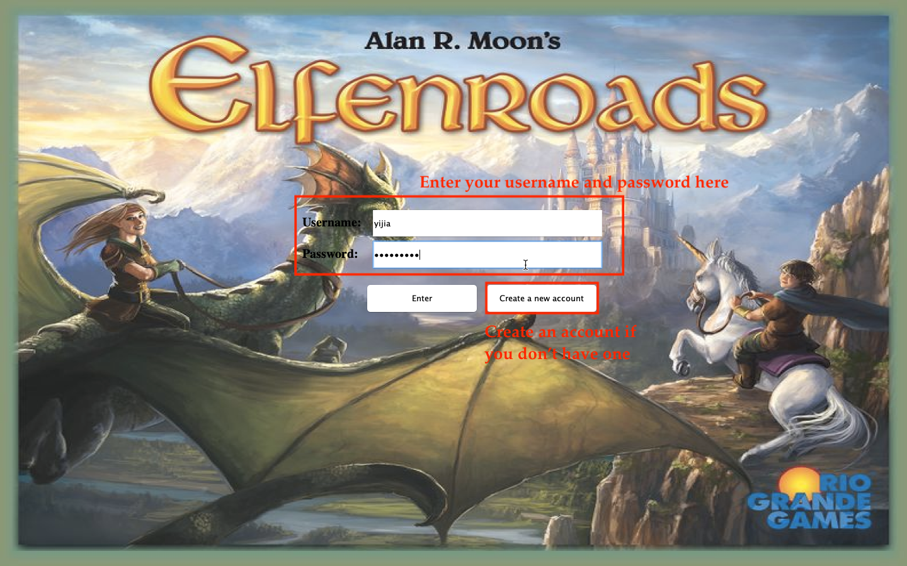

### Lobby
Players can either create a new session, load a saved session, or join a newly created session.
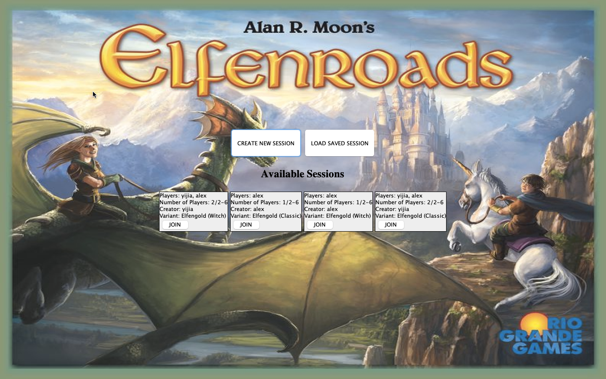

### Variant selection
When creating a new session, players can choose a variant.
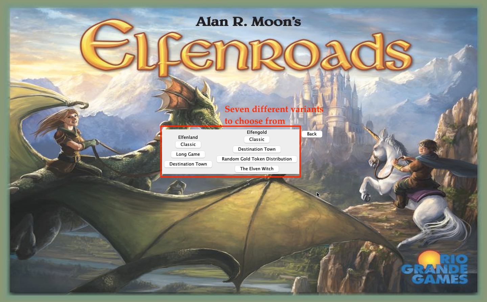

### Boots selection
Players choose their boot colors after creating or joining a game. After a player chooses their boot color, the color is removed from other players' selection screens in real time.
- The host player's screen.
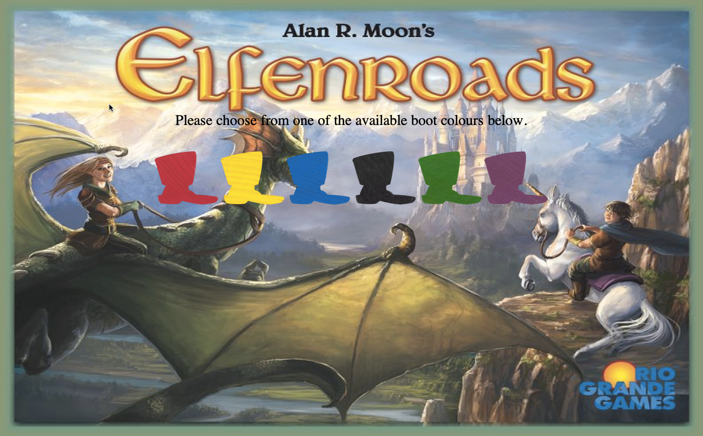
- The joining player's screen. Notice that yellow is removed since a player has already chosen this color.
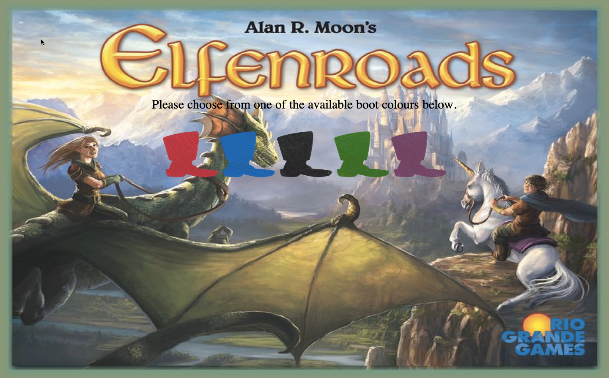

### Wait room
The host can start the game once there are at least two players. A joining player can leave and join again at any time.
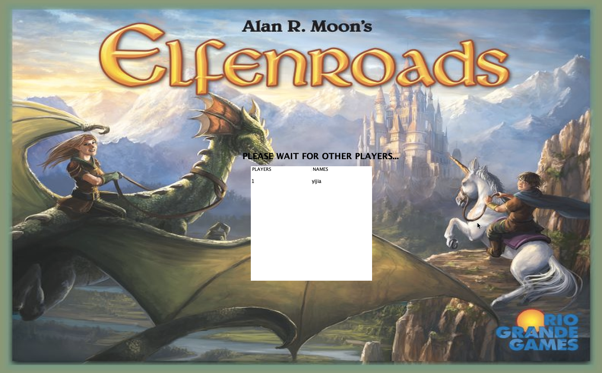
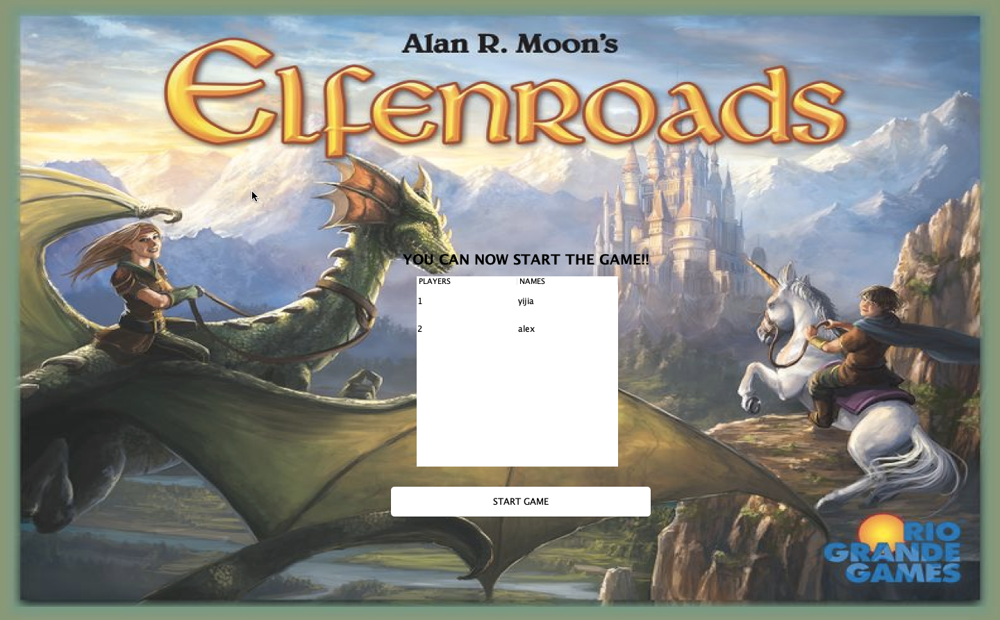

### Basic UI setup
#### Elfengold
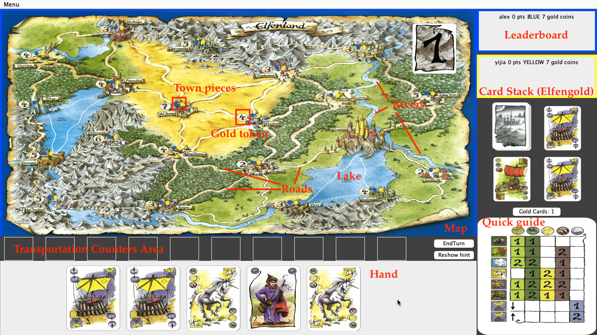

#### Elfenland
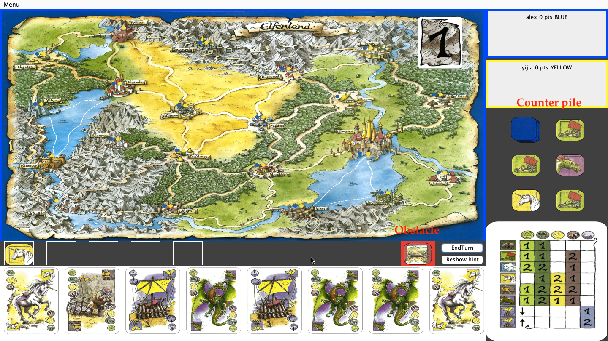

#### Scroll to see all cards in hand

### Pick Travel Card / Transportation Counters
When a player chooses a card or counter, the card stack or counter pile on all players' screens is updated in real time.

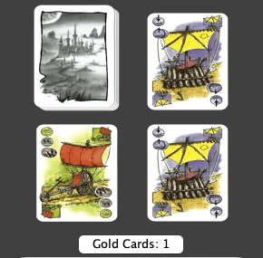

### Place Transportation Counters

### Leaderboard
Hover over a player to see their Transportation Counters. A square means that the counter is kept secret.

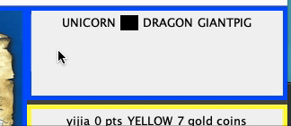

### Pop-up messages
Messages appear at the beginning of each game phase as a quick guide.

### Drop-down menu

### Chat
Chat with other players in real time!

### Auction
Players take turns bidding for Transportation Counters. As soon as a player increases the bid, the bid amount is updated on everyone's screen in real time.
- Waiting for other players to bid.
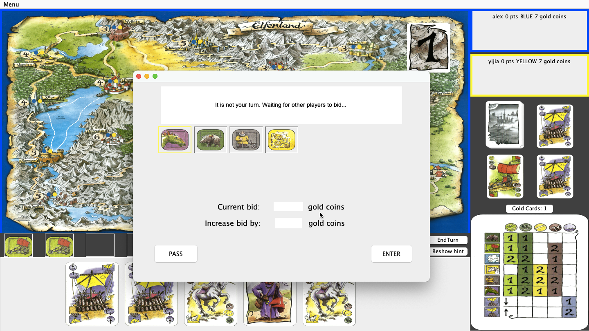
- The first player has increased the bid by 1.
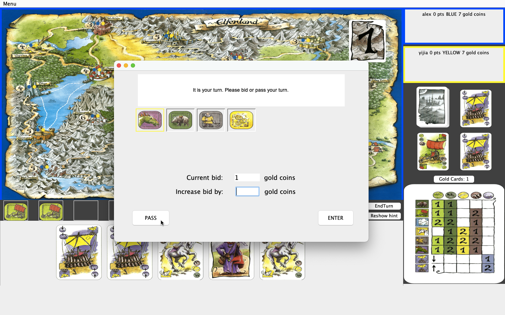

### Special Travel Card & Transportation Counters

#### Gold Pieces - earn double the gold value

#### Obstacle - must use an additional card to cross
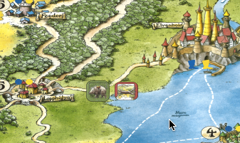

#### Witch card - move anywhere you want
To use a witch, a player needs to pay 3 coins. Notice that 3 coins are deducted from player *yijia* at the end of the move.

#### Exchange Spell - exchange two counters on the map

#### Double Spell - place an additional counter on a road

## Backend Information
* The game has a *peer-to-peer* networking architecture. A move object is handled by GUI and then sent to other players' computers using *serialization*.
* The *Command Pattern* is leveraged for enhanced reusibility. When a player takes action, command objects are instantiated, applied locally and sent over the network to other peers. Command instances are then read from the network on other computers and given to the executor to take effect. All commands are in the `commands` package.
* The towns are represented by a *directed multigraph*, where towns are vertices and roads/rivers are edges that can connect the same pair of towns. The Bellman-Ford Shortest Path algorithm is used to calculate the shortest distance between a player and their destination town.
* *Template Method Pattern* is used to define the common skeleton of multiple subclasses. For example, `GameManager` defines the common behaviors of `ELGameManager` (for Elfenland) and `EGGameManager` (for Elfengold).
* `GameManager` manages the game flow including turns, phases and rounds. `ActionManager` manages user actions such as a click event.
